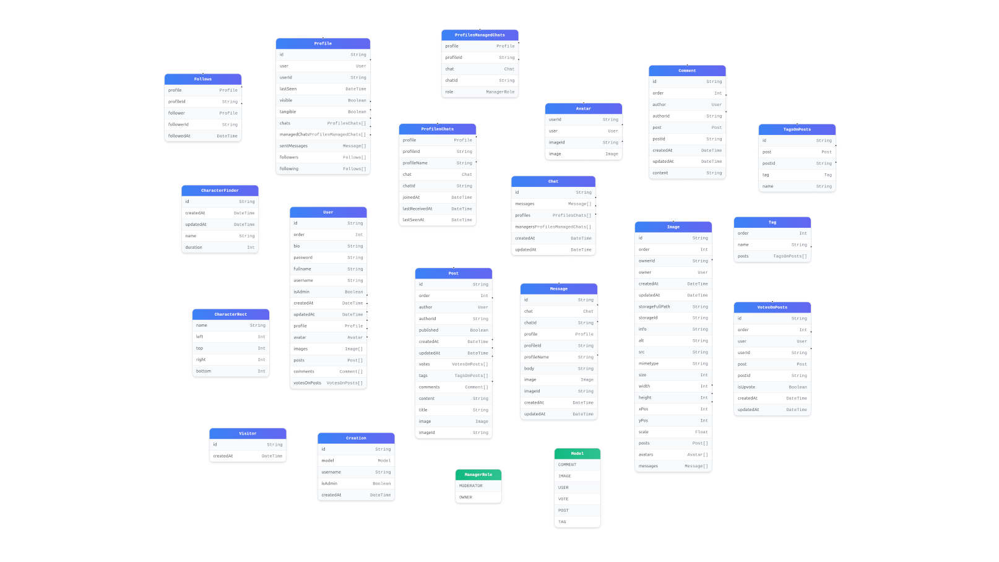

# Generic Express Service

A generic Express.js back-end service designed to support multiple front-end apps that I am managing to build in parallel with this app. It includes RESTful API endpoints, user authentication, and uses PostgreSQL for data storage.

> Finding a hosting service with a free tier for dynamic deployment is difficult, so I combined the backend of multiple apps in this project to deploy and run it in production for free.



## Apps Consumes This Service

1. [Odin Shopping Cart](https://github.com/hussein-m-kandil/odin-shopping-cart) —_for the user management only_
2. [Odin Blog Author](https://github.com/hussein-m-kandil/odin-blog-author)
3. [Odin Blog Viewer](https://github.com/hussein-m-kandil/odin-blog-viewer)
4. [Odin Where's Waldo](https://github.com/hussein-m-kandil/odin-where-is-waldo)
5. [Odin Messaging App](https://github.com/hussein-m-kandil/odin-messaging-app)

## Features

- **Bidirectional Communication**: Socket.IO server is used to support sending notifications from some of the endpoints.
- **User Management:** Full CRUD operations for users, including sign-up, sign-in, and a special guest sign-in route.
- **Authentication & Authorization:** Secure, JWT-based authentication using Passport.js, with support for partitioned cookies. It includes role-based access control, restricting certain actions to admins or resource owners.
- **Blog Engine:** Complete CRUD functionality for posts, comments, and votes. Posts can be classified using a flexible tagging system.
- **Image Handling:** Endpoints for uploading and managing images, including support for user avatars. Image metadata is processed using `Sharp`.
- **Advanced API Features:**
  - **Pagination:** Efficient pagination is available for all major resources, including posts, comments, users, and images.
  - **API Statistics:** An endpoint to track application statistics, such as visitor counts and other relevant metrics.
- **Robust Tech Stack:**
  - Built with **TypeScript** and **Express.js v5**.
  - Uses **Prisma ORM** for type-safe database access to a **PostgreSQL** database.
  - **Zod** for schema validation, ensuring data integrity.
  - **Winston** for structured, environment-based logging.
- **Development & Deployment:**
  - Local PostgreSQL integration via Docker Compose.
  - Tested using **Vitest** and **Supertest**.
  - Continuous Integration (CI) setup with **GitHub Actions** to prepare for deployment on every push to the main branch.

## Tech Stack

- [Node.js](https://nodejs.org/) / [Express 5](https://expressjs.com/)
- [TypeScript](https://www.typescriptlang.org/)
- [Socket.IO](https://socket.io/)
- [Zod](https://zod.dev) for validation
- [Winston](https://github.com/winstonjs/winston) for logging
- [Multer](https://github.com/expressjs/multer) for file uploads
- [JWT](https://jwt.io/) for authentication
- [Prisma](https://www.prisma.io/) ORM + PostgreSQL
- [Vitest](https://vitest.dev/) + [Supertest](https://www.npmjs.com/package/supertest) for testing
- [Docker Compose](https://docs.docker.com/compose/) for PostgreSQL
- [Sharp](https://sharp.pixelplumbing.com/) for image metadata and processing

## Local Development

### Prerequisites

- [Node.js](https://nodejs.org/) (tested on v22 but v20 should be fine too)
- [Docker](https://www.docker.com/) and [Docker Compose](https://docs.docker.com/compose/)

### Installation

1. **Clone the repository:**

   ```bash
   git clone https://github.com/hussein-m-kandil/generic-express-service.git
   cd generic-express-service
   ```

2. **Install dependencies:**

   ```bash
   npm install
   ```

3. **Set up the environment variables:**

   ```bash
   cp .env.test .env
   # Then edit `.env` to fit your local setup
   ```

4. **Start the PostgreSQL service:**

   ```bash
   npm run pg:up
   ```

5. **Push the Prisma schema to the database:**

   ```bash
   npx prisma db push
   ```

6. **Seed the database (optional):**

   ```bash
   npm run db:seed
   ```

7. **Start the development server:**

   ```bash
   npm run dev
   ```

   The API will be available at `http://localhost:8080`.

### Running Tests

```bash
# Prepare the test DB
npm run test:db:push
# Run all tests in watch mode. Append `-- --run` for single run
npm run test
```

### Scripts

- `npm run dev` — Start development server with hot reload.
- `npm run build` — Build TypeScript project.
- `npm start` — Run compiled server.
- `npm run lint` — Lint source files.
- `npm run type-check` — TypeScript type checks only.
- `npm run test` — Run tests with Vitest + Supertest.
- `npm run db:reset` — Reset Prisma migrations (skip seed).
- `npm run db:seed` — Seed database with sample data.
- `npm run pg:up` — Start PostgreSQL via Docker Compose.
- `npm run pg:stop` — Stop PostgreSQL container.
- `npm run pg:down` — Remove PostgreSQL container.

### Manual Testing

There are several HTTP request examples in `.rest` files located in the `/requests` directory. These can be used to manually test the API using the _[REST Client (VS Code extension)](https://marketplace.visualstudio.com/items?itemName=humao.rest-client)_, while the development server is running with the command `npm run dev`.

## Deployment

Every _push_ or _pull request (PR)_ on main branch, the app will be deployed to production automatically _if it passes all tests and checks performed by [a GitHub action for deployment preparation](./.github/workflows/deployment-prep.yml)_.

## Notes

- CORS is configured to allow only specific front-end origins under my control.

- JWT-based authentication is implemented and required by some endpoint.

- The `Bearer` schema is included in the authentication response, so the token should be sent _as is_ in an `Authorization` header.

- All error responses has the proper status code, but not all of them has a body (e.g. 401 Unauthorized). If an error response has a body it will have _at least_ the following:

  ```json
  {
    "error": {
      "message": "An example error"
    }
  }
  ```

- A validation error response body will have the form of _[ZodError.issues](https://zod.dev/?id=error-handling)._

## Disclaimer

I built this project to showcase what I am learning in web development, and I do not plan to keep maintaining it; therefore, _I added a reset feature to periodically delete any non-admin data_.
